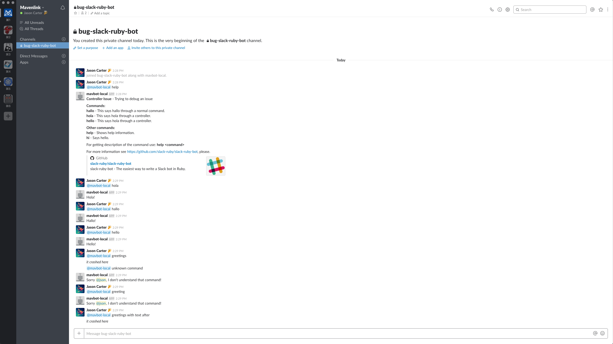

# Issue when using controllers
Here is a simple app with slack-ruby-bot installed with which to reproduce an issue with controllers

### Current Behavior
If I have a controller named GreetingsController, and say in slack `@bot greetings` with no corresponding `greetings` method, the bot crashes and raises a `NotImplementedError: <@U8W60F58V> greetings` error.

### Expected Behavior
If I have a controller named Greetings Controller, and say in slack `@bot greetings` with no corresponding `greetings` method, the bot should respond with the standard `Sorry @user, I don't understand that command!` 

### Running the app
```
gem install bundler
bundle install
cp .env.sample .env
# add a slack bot token to .env
ruby run.rb
```

### References

[Logs](logs.txt)
